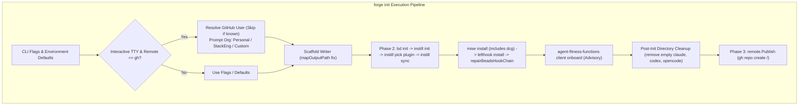

# GitHub Organization Selection, Agent Tooling, and Governance Integrations

**Status:** accepted · 2026-09-12

## Context

During the Forge Bug Bash (epic `agentic_template_start-sgz`), multiple operational and integration issues were identified across `forge init`, template assets, and generated repository tooling:

1. **GitHub Username and Organization Ambiguity:**
   `forge init` always prompted for a GitHub username even when configured via Git or environment variables. Furthermore, all repositories created with `--remote gh` were placed under the authenticated user's personal account (`AvogadroSG1`) via a bare `gh repo create <repo-slug>`. There was no mechanism to target GitHub organizations (such as `StackEng`), conflating user identity with organization ownership.
2. **OpenCode Permissions:**
   The scaffolded `opencode.jsonc` lacked permission grants for essential multi-project and external note/scratch workspaces (`~/ObsidianNotes/**`, `~/peter_code/scratch_work/**`, `~/peter_code/ai_support/**`, and `~/.plannotator/plans/**`), and omitted explicit `write: allow`.
3. **Agent Governance & Safety:**
   - `dcg` (Destructive Command Guard) was installed on developer workstations but not declared in stack toolchains, risking destructive operations in fresh or CI environments.
   - `agent-fitness-functions` architectural governance was not wired into the generated repo hook chain.
   - `peters-bdd-orchestrator` was absent from scaffolded agent plugin configurations.
4. **Scaffolding Cleanup:**
   Scaffold path mapping created extraneous empty directories (`claude/`, `codex/`, `opencode/`) alongside the intended hidden dot-directories (`.claude/`, `.codex/`, `.opencode/`).

## Decision

### 1. GitHub Organization Support and Non-Interactive Defaults
- **Configuration Hierarchy:** Pre-populate `--github-user` from `git config --global github.user`, `GITHUB_USER`, `GH_USER`, or active `gh` authentication (`gh api user -q .login`). In interactive mode, if the username is already resolved, do not prompt for it.
- **Organization Distinction:** Add `--github-org` (alias `--org`) flag to `forge init`. When `--remote gh` is selected in an interactive TTY, prompt the user with choices:
  - **Personal** (`<gh-user>`, e.g., `AvogadroSG1`)
  - **Authorized Organization** (e.g., `StackEng`, discovered via `gh api user/orgs`)
  - **Custom (typed)** organization name
- **Repository Creation & Module Path:** When an organization is specified, `project.Variables.ModulePath` derives as `github.com/<org>/<slug>`, and `remote.Publish` executes `gh repo create <org>/<slug> --source=. --remote=origin --private --push`.

### 2. OpenCode Permissions
- Update `templates/common/opencode.jsonc.tmpl` to add `permission.external_directory` with allow rules for:
  - `"~/ObsidianNotes/**": "allow"`
  - `"~/peter_code/scratch_work/**": "allow"`
  - `"~/peter_code/ai_support/**": "allow"`
  - `"~/.plannotator/plans/**": "allow"`
- Add `"write": "allow"` to `permission`.
- Position `external_directory` outside the managed allowlist block (`// BEGIN FORGE ALLOW v:2` ... `// END FORGE ALLOW`) so running `forge sync-allowlist` preserves user modifications.

### 3. Pipeline Additions and Advisory Governance
- **Destructive Command Guard (`dcg`):** Add `"github:Dicklesworthstone/destructive_command_guard" = "latest"` under `[tools]` in `.forge-overlay/mise.toml` across all golden stacks so `mise install` provisions `dcg` automatically.
- **BDD Orchestrator Plugin:** In Phase 2 of `internal/init/init.go`, execute `instill pick --type plugin peters-bdd-orchestrator` immediately after `runInstillInit` and before `instill sync`.
- **Architectural Fitness Functions:** In Phase 2 of `internal/init/init.go`, immediately after `repairBeadsHookChain`, run:
  `agent-fitness-functions client onboard --enforcement advisory`
  This execution is **advisory**: if `agent-fitness-functions` is not present on PATH, `forge init` logs an advisory notice and continues rather than failing the scaffold.
- **Directory Sanitization:** Correct `mapOutputPath` in `internal/scaffold/writer.go` to match unadorned directory names (`"claude"`, `"codex"`, `"opencode"`). Add post-installation cleanup in `internal/init/init.go` to delete `targetDir/claude`, `targetDir/codex`, and `targetDir/opencode` if they exist and are empty.

## Consequences

- Users can target GitHub organizations like `StackEng` cleanly without manual remote re-configuration or post-init repository moves.
- `forge init` is frictionless for existing GitHub users by avoiding redundant prompts.
- Generated repositories receive automatic safety guards (`dcg`), architectural fitness functions (`agent-fitness-functions`), and BDD orchestration tooling (`peters-bdd-orchestrator`).
- External note workspaces and scratch directories are accessible in OpenCode sessions without permission interruptions.

*Authored By Peter O'Connor with Assistance from OpenCode (google-vertex/gemini-3.8-flash) · 2026-09-12 · Forge Bug Bash 20260912*
