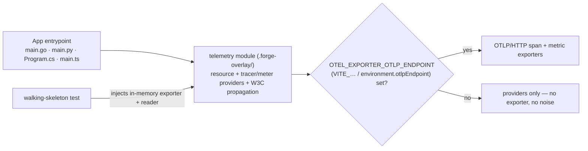

# Every stack ships an env-gated OpenTelemetry bootstrap

**Status:** accepted · 2026-09-13

## Context

PRD §4 promises that `forge init` output is "indistinguishable from hand-built". A hand-built
service in 2026 is observable from day one; none of the twelve golden stacks were. The walking
skeletons logged with `log` / `print` / `Console.WriteLine` and nothing else. Two guideline files
already *recommend* OpenTelemetry (`csharp.md` names `OpenTelemetry.Extensions.Hosting`,
`python.md` names `opentelemetry-sdk`) but nothing enforced or shipped it, so every generated repo
started with the same manual follow-up: pick an SDK, wire a provider, decide on an exporter, write a
test that proves the wiring is not dead code.

The four ecosystems have different idioms (Go options struct, Python module-level `configure()`,
C# `IServiceCollection` extension, TS `startTelemetry()`), three of the stacks are browser
bundles rather than Node processes, and the maintainer refresh path (ADR-0006) regenerates the
vanilla layer beneath the overlay, so anything we add must survive `forge update` untouched.

## Decision

Every shipped stack ships a **telemetry bootstrap** as a vetted extra (ADR-0010) in its
`.forge-overlay/`, with these properties:

- **Module + real test, refresh-immune.** One telemetry module lives in `.forge-overlay/`
  (`internal/telemetry/` for Go, `<package>/telemetry.py` for Python, `Telemetry.cs` +
  `TelemetryServiceCollectionExtensions.cs` for C#, `src/lib/telemetry.ts` / `src/app/telemetry.ts`
  for TypeScript) next to a test that drives a span and a metric through **in-memory**
  exporters and asserts both arrive. The test is part of the walking-skeleton guarantee
  (SPEC §16): `mise run test` is never vacuously green about observability.
- **Providers always, exporters only on demand.** The tracer and meter providers, the
  `service.name` resource (`OTEL_SERVICE_NAME`, else the repo slug) and W3C propagation are
  installed unconditionally. OTLP/HTTP exporters are attached **only** when
  `OTEL_EXPORTER_OTLP_ENDPOINT` is set. Browser stacks read the build-time equivalent instead:
  `VITE_OTEL_EXPORTER_OTLP_ENDPOINT` for vite-ts and sveltekit, `environment.otlpEndpoint` in
  Angular's `environment.ts`. With no endpoint a generated repo emits **no** exporter errors,
  retries or console noise.
- **Traces + metrics.** Logs are deferred to a follow-up issue (slog handler, Python
  `LoggingHandler`, `ILogger` via `OpenTelemetry.Logs`, browser console bridge).
- **TypeScript uses `@opentelemetry/sdk-trace-web`.** vite-ts, sveltekit and angular are all
  browser bundles; `sdk-node` would be dead weight that never runs. `instrumentation-fetch`
  traces the existing `/health` client call.
- **Python additionally exposes `opentelemetry-instrument`.** Each Python `mise.toml` gains a
  `serve` task (`run-cli` for typer) that runs the app under the zero-code wrapper. The task
  guards the exporter: with no `OTEL_EXPORTER_OTLP_ENDPOINT` it sets
  `OTEL_{TRACES,METRICS,LOGS}_EXPORTER=none`; with one it defaults
  `OTEL_EXPORTER_OTLP_PROTOCOL` to `http/protobuf` so the distro selects the HTTP exporter we
  ship. In-process `configure()` returns the already-live SDK provider when the wrapper has
  installed one, so the two paths do not double-configure.
- **C# extension lives in `Microsoft.Extensions.DependencyInjection`.** The verbatim,
  non-templated `csharp-webapi/Program.cs` can then call
  `builder.Services.AddDefaultOpenTelemetry()` under implicit usings without a `using`
  directive; blazor and cli use the same one-liner.
- **Vetted extra, no guideline edits.** Per ADR-0010 the guideline is the floor; the
  conformance test is not touched and the guideline files are not amended.
- **Pinned versions.** Go `go.opentelemetry.io/otel*` v1.46.0 + `contrib` v0.71.0; Python
  `opentelemetry-distro~=0.65b0` + `opentelemetry-exporter-otlp-proto-http~=1.44` (+
  `instrumentation-fastapi~=0.65b0` on the FastAPI stacks); C# `OpenTelemetry.*` 1.18.0 (+
  `OpenTelemetry.Exporter.InMemory` in test projects); TS `@opentelemetry/api ^1.9.1`,
  `sdk-trace-web`/`sdk-metrics`/`resources ^2.11.0`, exporters + instrumentation `^0.222.0`.
  Dependencies are edited in the stack manifests (`go.mod.tmpl`, `pyproject.toml.tmpl`,
  `*.csproj.tmpl`, overlay `package.json.tmpl`), the existing precedent for StyleCop,
  Swashbuckle and pytest.

## Considered Options

- **Always-on OTLP to `localhost:4318`.** The OTel SDK default; rejected because a fresh
  `go run ./cmd/api` or `mise run serve` with no collector logs connection-refused retries on
  every export interval. Noise on day one is the opposite of "hand-built".
- **Console exporter by default.** Proves the wiring at a glance but pollutes CLI stdout (typer,
  cobra, csharp-cli print their greeting there) and is never what production wants. Kept only as
  the explicit flag in the Python `opentelemetry-instrument` subprocess test.
- **`@opentelemetry/sdk-node` for TypeScript.** Consistent with the server stacks but the three
  TS stacks are browser bundles; the Node SDK's auto-instrumentations never execute and pull in
  `require`-only modules that Vite/esbuild cannot tree-shake.
- **Promote OpenTelemetry to an enforced guideline MUST.** Would make the `ebp` conformance
  test the owner; rejected for now because only two of four guideline files mention OTel at
  all, and ADR-0010 exists precisely so vetted extras ship without a guideline round-trip.
  Owning test is instead `TestGoldenStacksShipTelemetryBootstrap` (SPEC §18).
- **Adding the dependencies as `sources.yaml` recipe steps.** Would let `forge update` re-add
  them, but the recipe produces the *vanilla* layer and vetted opinions belong to the overlay
  (ADR-0005); the manifests are already hand-edited for other overlay tools.

## Consequences

- Every generated repo gains four to nine new pinned dependencies that flow into the existing
  `mise run ci` audit steps (`govulncheck`, `pip-audit`, `dotnet list package --vulnerable`,
  `npm audit`). Version bumps are a normal overlay edit.
- **Angular initial bundle.** The OTel web SDK adds roughly 150-250 kB to the `initial` bundle
  against Angular's 500 kB budget *warning*. `ci` does not run `ng build`; if the warning ever
  matters, the mitigation is a lazy `import()` from the `provideAppInitializer` callback.
- **chi span names.** `otelhttp.NewHandler` wraps the router, so `chi.RouteContext` is nil when
  the span-name formatter runs and the route *pattern* is unavailable. Spans are named
  `METHOD path` (`GET /health`), which is high-cardinality for parameterised routes. Replacing
  the formatter with `otelchi` or equivalent is a filed follow-up.
- Refresh seam: new `internal/telemetry/` directories are orphans on `forge update`, exactly
  like today's `internal/httpapi/`, `internal/web/` and `tests/Project.Tests/`; no new failure
  class. Cobra places the module at `cmd/telemetry.go` (vanilla parent) and the Python, C# root,
  `src/lib/`, `src/app/` and `src/hooks.client.ts` placements all have vanilla parents.
- **Entrypoint wiring in vanilla files.** The one-line calls that start the bootstrap live in
  the already hand-authored vanilla entrypoints (`python-fastapi` and `python-cli-typer`
  `main.py`, `csharp-cli` and `csharp-webapi` `Program.cs`, Angular `app.config.ts`), matching
  the existing precedent (StyleCop and pytest pins in vanilla manifests, `partial class
  Program`). `forge update` is Go-only today and those Go vanilla files are untouched: the cobra
  stack starts its per-command span from the overlay `PersistentPreRunE`, so `cmd/serve.go`
  and `cmd/config.go` stay byte-identical to `cobra-cli` output. Re-capturing a Python, C# or
  Angular vanilla layer by hand must re-apply those calls or the overlay telemetry test goes red
  by design.
- `templates/common/AGENTS.md.tmpl` and `README.md.tmpl` document the env contract outside the
  managed block; they are not in `internal/upgrade` managed hashes, so no infra version bump.
- Logs signal, `TestLocalRelease` coverage for the three fullstack stacks, and chi route-pattern
  span names are filed as Beads follow-ups, not part of this change.
