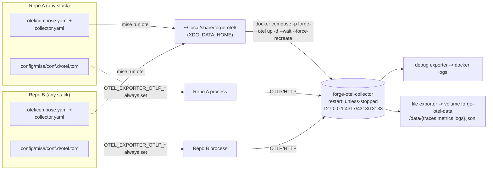

# A system-wide OpenTelemetry Collector, started by `mise run otel`

**Status:** accepted · 2026-09-25

## Context

ADR-0020 gave every golden stack a telemetry bootstrap: providers always on, OTLP/HTTP exporters
only when `OTEL_EXPORTER_OTLP_ENDPOINT` is set. That was deliberately conservative — no endpoint
by default means no connection-refused retries on a fresh `go run` or `mise run serve` — but it
also means the exporters never turn on without manual setup. Nothing in a generated repo ever
gave the developer a collector to point at, so "observable from day one" stopped at "instrumented,
but unseen." Every repo still needed the same follow-up: install a collector, wire the endpoint,
remember to do it again in the next repo.

`forge init` output MUST work without `forge` installed (SPEC §1), so the fix cannot be a new
`forge` subcommand or a daemon `forge` manages — it has to be something the generated repo itself
knows how to start, the same way it already knows how to run its own gate pipeline. `mise` is
already the one task runner every stack carries, and `mise` merges every file under
`.config/mise/conf.d/*.toml` into a project's own `mise.toml` (verified against the pinned `mise`
version before committing to this design). That merge point lets forge add environment and tasks
without templating or diffing twelve stack-specific `mise.toml` files.

## Decision

Every `forge init` repo ships three new common assets, identical for all twelve stacks:

- `.config/mise/conf.d/otel.toml` — a forge-owned file mise merges on top of the repo's own
  `mise.toml`. It carries an `[env]` block and four `[tasks]`.
- `.otel/compose.yaml` and `.otel/collector.yaml` — a Docker Compose stack and OpenTelemetry
  Collector Contrib pipeline config, copied (not run in place) to a fixed system directory by the
  `otel` task.

**`[env]` always sets the OTLP endpoints — this amends ADR-0020's default.** Every process `mise`
launches in the repo now sees:

```
OTEL_EXPORTER_OTLP_ENDPOINT      = http://localhost:4318
OTEL_EXPORTER_OTLP_PROTOCOL      = http/protobuf
OTEL_EXPORTER_OTLP_TRACES_ENDPOINT  = http://localhost:4318/v1/traces
OTEL_EXPORTER_OTLP_METRICS_ENDPOINT = http://localhost:4318/v1/metrics
OTEL_EXPORTER_OTLP_LOGS_ENDPOINT    = http://localhost:4318/v1/logs
VITE_OTEL_EXPORTER_OTLP_ENDPOINT    = http://localhost:4318
```

The ADR-0020 in-code gate (`if OTEL_EXPORTER_OTLP_ENDPOINT is set, attach exporters`) is
unchanged and still exists — it is what makes this safe. Under `mise`, the branch that used to be
theoretical is now the one every command takes. Outside `mise` (a bare `go run`, an IDE run
configuration, a CI job that does not shell through `mise`), the environment variables are unset
and the app stays exactly as silent as ADR-0020 specified. This ADR narrows ADR-0020's "off by
default" to "off by default outside mise"; it does not reopen or reverse that decision.

**Tasks — `mise run otel` is the run function.** `otel` (alias `otel:up`) checks for Docker,
copies `.otel/*` to `${XDG_DATA_HOME:-$HOME/.local/share}/forge-otel/`, and runs
`docker compose -p forge-otel up -d --wait --force-recreate otel-collector`, then polls the
health endpoint. `otel:down`, `otel:status`, and `otel:logs` round out the lifecycle. Because the
target directory and the Compose project name (`forge-otel`) are fixed, running `mise run otel`
from *any* forge repo on the machine converges on the same one collector — the second repo's copy
overwrites the first's (identical byte-for-byte across repos on the same forge version;
last-writer-wins across differing forge versions, see Consequences).

**Re-running `mise run otel` restarts the shared collector every time.** `collector.yaml` is
bind-mounted into the container, so editing it does not change the Compose config hash; a plain
`docker compose up` would leave the running collector on the old pipeline and silently ignore the
edit. `--force-recreate` guarantees the copied config is the one that runs. The accepted
trade-off: each run briefly pauses telemetry from every repo on the machine while the collector
is recreated; OTLP SDKs buffer or retry across the gap. `depends_on` still runs the one-shot
`otel-data-init` step before the collector starts.

**Task bodies are POSIX `sh`, and checkout paths are never shell source.** `mise` runs inline
`run` bodies with `sh`, which is `dash` on Debian/Ubuntu (including GitHub's `ubuntu-latest`), so
every body uses `set -eu` and no bashisms (`pipefail`, `[[`, arrays, `local`, `source`, process
substitution, `&>`). The `otel` task sets its working directory declaratively with
`dir = "{{config_root}}"` — `mise` resolves that to the repo root itself, without a shell — and
copies from relative `.otel/` paths. No `{{config_root}}` or other path template appears inside a
`run` body: `mise` renders templates into the script text before the shell parses it, so a
checkout path containing `$(...)` or quotes would otherwise execute.



**Why `conf.d`, not templated `mise.toml` edits.** Editing twelve stacks' `mise.toml.tmpl` (plus
whatever overlay copies exist per stack) for one shared concern multiplies the diff by twelve and
gives forge twelve places to keep in sync on every future collector change. `conf.d` is a single
wholly-owned file: forge writes it, nothing else does, and `forge upgrade` can blind-copy it like
the other wholly-owned files in ADR-0016's ownership taxonomy.

**Why system-wide and `restart: unless-stopped`, not one collector per repo.** A developer
routinely has several forge repos checked out. A per-repo collector means per-repo ports, per-repo
`docker compose` state, and N idle containers for N repos most of which are not being actively
run. One collector, started by whichever repo asks for it first and reused by the rest, matches
how the machine is actually used. `unless-stopped` means it survives a Docker daemon restart or a
reboot without the developer remembering to re-run `mise run otel`.

**Why loopback-only ports.** The collector accepts unauthenticated OTLP from anything that can
reach it. Binding `4317`/`4318`/`13133` to `127.0.0.1` keeps it reachable only from the same
machine, matching every other local-dev-only surface in a forge repo — no LAN or container-network
exposure by default.

**Why `debug` + `file` exporters and no UI.** A collector needs somewhere to send signals; forge
does not ship a UI, so `docker logs forge-otel-collector` (via the `debug` exporter) and
newline-delimited JSON files under the `forge-otel-data` volume (via the `file` exporter, one file
per signal, `mise run otel:logs` and the `.jsonl` files respectively) are enough to prove signals
are flowing without taking on a second running service.

## Considered Options

- **Grafana LGTM stack or Jaeger as the backend.** Either gives a real UI, but both are a second
  (or several) always-on service per machine, a much bigger image pull, and a UI forge would then
  need to document, version, and keep working. Out of scope for "prove telemetry is flowing";
  filed as a possible follow-up if a UI is ever wanted.
- **One collector per repo.** Rejected in Decision above — N idle containers, N port ranges to
  track, no shared state.
- **A `forge otel` CLI subcommand.** Would violate "generated repos work without forge installed"
  (SPEC §1, ADR-0004's invariant list): the collector must be startable by tooling already inside
  the repo, not by re-invoking the generator.
- **Always-on OTLP with no collector shipped at all (status quo).** This is what ADR-0020 shipped.
  Rejected as the final state because it leaves every repo one manual collector setup short of
  actually showing telemetry, which is the gap this ADR closes.

## Consequences

- **Docker is now required to see telemetry.** It was already optional for a forge repo generally;
  `mise run otel` is the first task that needs it. Everything else in the repo, including the
  telemetry bootstrap itself, works with no Docker installed — the exporters just have nowhere to
  send data.
- **Retry noise when the collector is down, under `mise`.** Because `OTEL_EXPORTER_OTLP_ENDPOINT`
  is now always set for processes `mise` launches, an SDK will log export retry/connection-refused
  errors if `mise run otel` was never run or the collector was stopped. This is the trade-off
  ADR-0020 was written to avoid outside `mise`; inside `mise` it is accepted in exchange for
  telemetry working by default. Outside `mise`, ADR-0020's silence holds.
- **A Docker Hub pull.** `otel/opentelemetry-collector-contrib:0.161.0` and `busybox:1.36` (a
  one-shot init step that `chown`s the `forge-otel-data` volume to the collector's non-root uid
  10001 before the collector starts, since Docker creates named volumes root-owned) are pulled the
  first time `mise run otel` runs on a machine.
- **The logs endpoint is wired in `[env]` today even though only the Python stacks emit logs.**
  ADR-0020 deferred a logs signal for Go/C#/TypeScript to a follow-up; `OTEL_EXPORTER_OTLP_LOGS_ENDPOINT`
  is set for all stacks now so no further `conf.d` edit is needed once that follow-up ships.
- **`forge upgrade` propagates these three files** the same way it propagates the rest of the
  managed infrastructure set (SPEC §19): `.config/mise/conf.d/otel.toml` is wholly forge-owned and
  blind-copied; `.otel/compose.yaml` and `.otel/collector.yaml` likewise. The infrastructure
  version is bumped so existing repos pick the files up on their next `forge upgrade`.
- **Config is last-writer-wins across repos on differing forge versions.** Because every repo
  copies its own `.otel/*` into the same system directory, the collector actually running at any
  moment reflects whichever repo most recently ran `mise run otel` — on a machine with repos
  scaffolded by different forge versions, that can transiently mean an older or newer collector
  pipeline config than the repo currently being worked in expects. In practice this only matters
  when `.otel/collector.yaml` itself changes; running `mise run otel` again in the repo you're
  working on re-syncs it.
