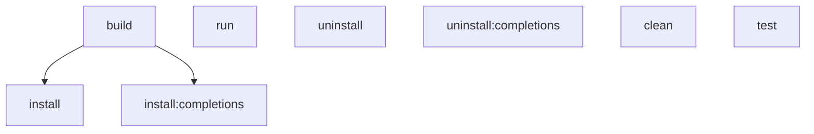

# `mise run` is forge's primary contributor task interface; `make` stays, in parallel

**Status:** accepted · 2026-09-26

## Context

Contributors to the `forge` generator itself (not a generated repo — see ADR-0021 for that
surface) had one task entry point: the root `Makefile` (`make build`, `make test`, `make install`,
`make install BINDIR=...`, `make uninstall`, `make clean`, default target `help`). Every stack
`forge init` ships, meanwhile, standardizes contributors of *generated* repos on `mise run <task>`
(SPEC §9.5, ADR-0021) — `forge`'s own contributor workflow was the one place in the project that
did not use the tool it hands every downstream repo. Root `mise.toml` only pinned a `[tools]`
entry (`bats`), with no `[tasks]` of its own.

Separately, `forge` had no shell completion. Contributors and users alike had to spell out
`sync-allowlist`, `upgrade --check`, and every flag from memory or `--help`.

## Decision

**Root `mise.toml` gains a `[tasks]` block that wraps the same actions the `Makefile` already
performs, where a `Makefile` target exists**, so contributors can use either without the two
drifting on the tasks they share:

| `mise run` task | Depends on | `make` counterpart | Behavior |
|---|---|---|---|
| `build` | — | `make build` | Builds the repo-local `forge` binary. |
| `test` | — | `make test` | Runs the Go test suite. |
| `run` | — | *(none)* | `mise run run -- <forge args>` — one-off `forge` invocation without writing a binary. |
| `install` | `build` | `make install` | Installs `forge` to `$BINDIR` (default `$HOME/.local/bin`). |
| `install:completions` | `build` | *(none)* | Writes the zsh completion script as `_forge` to `$FORGE_ZSH_COMPLETIONS_DIR` (default `${XDG_DATA_HOME:-$HOME/.local/share}/zsh/site-functions`). |
| `uninstall` | — | `make uninstall` | Removes the installed binary from `$BINDIR`. |
| `uninstall:completions` | — | *(none)* | Removes the installed `_forge` script from `$FORGE_ZSH_COMPLETIONS_DIR`. |
| `clean` | — | `make clean` | Removes repo-local build output. |

**The `Makefile` is retained unchanged and independently, not deprecated.** `mise run <task>` and
the corresponding `make <target>` are two entry points to the same behavior for the tasks that
have a `make` counterpart. `run`, `install:completions`, and `uninstall:completions` are mise-only:
they exist because completion generation and passthrough one-off invocation are new with this ADR,
not because the Makefile is deliberately kept behind — a contributor who prefers `make`, or is in
an environment without `mise` installed, still gets build/test/install/uninstall/clean, but must
use `forge completion zsh` directly (or install `mise`) for shell completion. This mirrors how
ADR-0021 keeps `mise` tasks additive rather than replacing what already worked outside `mise`.

**`forge completion zsh` is generated, not hand-written, and zsh-only.** `cmd/forge/completion.go`
builds the script from the same command table and `flag.FlagSet` constructors
(`initFlagSet`, `syncAllowlistFlagSet`, `updateFlagSet`, `upgradeFlagSet`) the real runners call —
a flag added to a runner appears in completion automatically, with no second place to update. The
generated script is valid both ways zsh loads a completion function: saved as `_forge` in an
`fpath` directory and autoloaded via `compinit`, or sourced directly
(`source <(forge completion zsh)`), which is why the script's tail branches on
`$funcstack[1]`. Only zsh is supported for v1 — it is the shell forge's own contributor tooling
and target audience (macOS default shell, most Linux dev setups with `oh-my-zsh`/`compinit`
already configured) actually uses; an unsupported or missing shell argument is a named error
(`unsupported shell %q (supported: zsh)`) rather than a silent no-op, so `mise run
install:completions` fails loud if it is ever pointed at a different shell.

## Considered Options

- **Replace the `Makefile` with `mise.toml` tasks.** Rejected: some contributors and CI shells
  reach for `make` reflexively, `mise` is not guaranteed to be on every contributor's `PATH`
  before they bootstrap the repo, and there is no forcing requirement (unlike the generated-repo
  gate pipeline in ADR-0003) that makes one interface strictly necessary. Keeping both costs one
  small, mechanical `mise.toml` file that wraps the same underlying commands.
- **Support bash/fish completion alongside zsh.** Rejected for v1: no established contributor
  need, and `completionCommands`/`zshCompletionScript` would need shell-specific renderers with
  their own quoting rules and tests. `supportedCompletionShells` is a slice specifically so a
  future shell is additive, not a rewrite.
- **A `forge completion install` subcommand that writes the file itself.** Rejected in favor of
  `mise run install:completions` performing the write: it keeps `forge completion zsh` a pure
  stdout generator (easy to test, easy to pipe), and filesystem side effects live in the task
  layer the way `install`/`uninstall` already do for the binary itself.

## Consequences

- **Two equivalent entry points to maintain, for the tasks both cover.** A new contributor task
  that also belongs in the `Makefile` (or a changed default, like `BINDIR`) must be added to both
  `mise.toml` and the `Makefile` to keep them equivalent; nothing enforces that mechanically today.
  This is the same trade-off already accepted for the `Makefile`/`README.md` pairing before this
  ADR. `run`, `install:completions`, and `uninstall:completions` are exempt by design — they have
  no `make` counterpart (see the Decision table) and are not meant to gain one.
- **`FORGE_ZSH_COMPLETIONS_DIR` is a new environment override**, alongside the existing `BINDIR`.
  `BINDIR` defaults to `$HOME/.local/bin`; only `FORGE_ZSH_COMPLETIONS_DIR` follows the
  `${XDG_DATA_HOME:-$HOME/.local/share}` convention the OTel collector's install path uses
  (ADR-0021) — the two overrides have different defaults, so contributors should not assume one
  pattern covers both.
- **Completion coverage tracks the runner constructors, not a maintained list.** If a runner adds
  a flag but forgets to route it through its `*FlagSet` constructor, completion silently misses
  it too — the fix is to keep flags defined only in the constructor, never inline in the runner.
- **zsh-only is a real gap for bash/fish contributors** until a follow-up adds their renderers;
  `forge completion <other-shell>` fails with a clear "unsupported shell" error today rather than
  emitting something broken.
