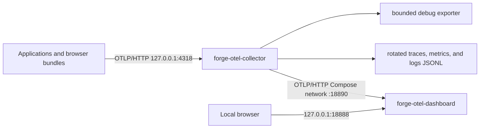

# An Aspire Dashboard viewer behind the system-wide OpenTelemetry Collector

**Status:** accepted · 2026-09-28

## Context

ADR-0021 established one machine-wide OpenTelemetry Collector as the stable local ingress for every generated repository. Applications and browser bundles send OTLP/HTTP to host port `4318`; the Collector preserves received traces, metrics, and logs in bounded Docker debug output and rotated JSONL files. That topology proves data is flowing, but inspecting structured logs, traces, and metrics requires reading raw output and offers no visual correlation path.

The viewer must remain a local development aid. It must not replace the Collector, change application exporter configuration, expose unauthenticated telemetry services beyond loopback, add durable storage, or expand the existing application log-emission boundary.

## Decision

The shared `forge-otel` Compose project additionally runs the standalone Aspire Dashboard image `mcr.microsoft.com/dotnet/aspire-dashboard:13.5.2` as service `otel-dashboard`, with container name `forge-otel-dashboard` and `restart: unless-stopped`.

Only the dashboard frontend is published, at `127.0.0.1:18888:18888`. Anonymous access is enabled with `DOTNET_DASHBOARD_UNSECURED_ALLOW_ANONYMOUS=true`; that setting is acceptable only because the sole host publication is loopback-only. The dashboard's OTLP/gRPC port `18889` and OTLP/HTTP port `18890` are not published to the host. Dashboard telemetry is held in memory and disappears whenever the dashboard container restarts; no dashboard volume or second storage backend is added. Its Docker logs use the same bounded `local` driver policy as the Collector: `max-size: "10m"`, `max-file: "3"`.

Applications and browser bundles continue sending OTLP/HTTP to the existing Collector on host port `4318`. The Collector remains the stable ingress and CORS boundary and retains its `debug` and `file/{traces,metrics,logs}` exporters, processors, health endpoint, storage bounds, and loopback bindings. It additionally defines exporter `otlphttp/aspire` with endpoint `http://otel-dashboard:18890` and `compression: none`; Aspire's standalone OTLP/HTTP receiver does not decode the Collector exporter's default gzip payload. The traces, metrics, and logs pipelines all fan out to that exporter.

The Collector depends on `otel-dashboard` with `condition: service_started`. `mise run otel` continues targeting exactly `otel-collector` with `--force-recreate`: Compose starts the dashboard dependency, while repeated runs recreate the Collector without forcing recreation of an unchanged dashboard. This preserves the dashboard container and its in-memory telemetry across Collector configuration refreshes. Readiness requires both Collector health at `http://127.0.0.1:13133` and a successful dashboard frontend response at `http://127.0.0.1:18888`.

**Why Aspire Dashboard.** One development-focused container presents structured logs, traces, and metrics together. It is materially smaller and simpler to operate than a Grafana, Tempo, Loki, and Prometheus bundle while covering the local inspection need.

**Why applications do not send directly to Aspire.** Direct export would create a second ingress contract, bypass the Collector's browser CORS point, and lose the existing bounded debug and file evidence path. The Collector remains the one stable endpoint and fans out every accepted signal to both retained outputs and the viewer.

**Why anonymous, loopback-only access.** Authentication would add local setup cost without protecting a remotely reachable surface because no dashboard port is bound beyond `127.0.0.1`. A non-loopback publication is a configuration failure, not a reason to broaden this decision with authentication infrastructure.

## Considered Options

- **Grafana, Tempo, Loki, and Prometheus.** Rejected for this local development surface: several services, more configuration and storage, and a larger operational and image footprint.
- **Send applications directly to Aspire.** Rejected because it bypasses the Collector's stable ingress/CORS contract and retained bounded outputs.
- **Persist dashboard data.** Rejected because the viewer is intentionally short-lived. Rotated Collector JSONL files remain the retained local evidence.
- **Publish Aspire's OTLP ports.** Rejected because applications already have one host ingress at Collector port `4318`; extra unauthenticated ports create ambiguity and exposure without value.

## Consequences

- `mise run otel` starts two long-lived services in one Compose project and reports both Collector health and viewer reachability.
- The UI is available without login at `http://127.0.0.1:18888` from the local machine only.
- Recreating the Collector does not recreate an unchanged dashboard, so current in-memory viewer data survives Collector config refreshes. Restarting or recreating the dashboard clears that data.
- Every received traces, metrics, and logs pipeline is forwarded to Aspire while the existing debug and bounded JSONL outputs remain unchanged.
- The dashboard Logs page shows only OTLP logs that applications actually export. This decision adds no Go, C#, or TypeScript application logging bridge and does not change ADR-0020's signal-support boundary.
- ADR-0021 is amended only where it selected “no UI.” Its Collector rationale, topology history, output bounds, and considered-options record remain authoritative.
