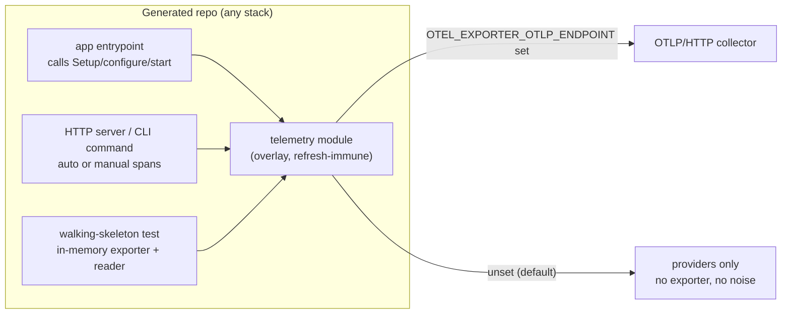

# Default OpenTelemetry Bootstrap in Every Forge Stack

- **Date:** 2026-09-13
- **Status:** Approved
- **Issue:** `agentic_template_start-6cf` (children `.1` – `.8`)

## 1. Problem Statement

`forge init` must produce a repo that is "indistinguishable from hand-built" (PRD §4). None of the twelve golden stacks ship observability: the walking skeletons log with `log` / `print` / `Console.WriteLine` and nothing else. Two guideline files already recommend OpenTelemetry (`csharp.md` → `OpenTelemetry.Extensions.Hosting`, `python.md` → `opentelemetry-sdk`) but nothing enforces or ships it, so every generated repo begins with the same manual follow-up.

## 2. Goals & Non-Goals

### Goals
- Every generated repo, CLI or web, gets a working OpenTelemetry bootstrap (traces + metrics) on day one.
- The bootstrap is exercised by a real passing test with in-memory exporters (non-vacuous-test guarantee, SPEC §16).
- Zero noise when no collector is running: providers always installed, OTLP/HTTP exporters attached only when `OTEL_EXPORTER_OTLP_ENDPOINT` is set (browser: `VITE_OTEL_EXPORTER_OTLP_ENDPOINT` / Angular `environment.otlpEndpoint`).
- Ship as a vetted extra per ADR-0010 with no guideline or conformance-test edits.
- Record the decision in ADR-0020 and align SPEC §9.4 / §10.1 / §18, CONTEXT.md, and the generated `AGENTS.md` / `README.md`.

### Non-Goals
- Logs signal bridges (slog handler, Python `LoggingHandler`, `ILogger` via `OpenTelemetry.Logs`, browser console) — filed as a follow-up.
- Promoting OpenTelemetry to an enforced guideline MUST.
- Adding `go-web-templ`, `python-web-jinja`, `csharp-blazor` to `TestLocalRelease` — filed as a follow-up.
- Chi route-pattern span names via `otelchi` — filed as a follow-up.

## 3. Detailed Design

### 3.1 Decisions

| Question | Decision |
|---|---|
| TS SDK | `@opentelemetry/sdk-trace-web` in all three TS stacks (they are browser bundles; `sdk-node` would be dead code) |
| Exporter default | Env-gated OTLP/HTTP: providers always installed; OTLP exporters added only when the endpoint env is set |
| Signals | Traces + metrics; logs deferred |
| Guideline status | Vetted extra (ADR-0010) — no guideline or conformance-test edits |
| Placement | New files in `.forge-overlay/` (refresh-immune); manifests and hand-authored vanilla entrypoints edited in place (existing precedent) |

### 3.2 Architecture

Every stack gets the same four things in the idiom of its ecosystem:

1. **Dependencies** pinned in the stack manifest (versions resolved 2026-09-13).
2. **One telemetry module** in `.forge-overlay/` exposing a setup function that (a) builds a resource with `service.name` (`OTEL_SERVICE_NAME`, else `{{.RepoSlug}}`), (b) installs global tracer + meter providers and W3C propagation, (c) env-gates OTLP exporters, and (d) accepts an injectable exporter/reader so tests stay hermetic.
3. **Wiring** in the entrypoint: HTTP stacks get server instrumentation; CLI stacks get one manual span around the command.
4. **A real test** next to the module asserting a span and a metric are produced with in-memory exporters.

### 3.3 Pinned Versions

| Platform | Packages |
|---|---|
| Go | `go.opentelemetry.io/otel`, `otel/sdk`, `otel/sdk/metric`, `otel/exporters/otlp/otlptrace/otlptracehttp`, `otel/exporters/otlp/otlpmetric/otlpmetrichttp` **v1.46.0**; `go.opentelemetry.io/contrib/instrumentation/net/http/otelhttp`, `contrib/instrumentation/runtime` **v0.71.0** |
| Python | `opentelemetry-distro~=0.65b0`, `opentelemetry-exporter-otlp-proto-http~=1.44` (all 3); `opentelemetry-instrumentation-fastapi~=0.65b0` (fastapi, web-jinja) |
| C# | `OpenTelemetry.Extensions.Hosting`, `OpenTelemetry.Exporter.OpenTelemetryProtocol`, `OpenTelemetry.Instrumentation.Runtime` **1.18.0** (all 3); `OpenTelemetry.Instrumentation.AspNetCore`, `OpenTelemetry.Instrumentation.Http` **1.18.0** (webapi, blazor); `Microsoft.Extensions.DependencyInjection` **10.0.x** (cli); test projects add `OpenTelemetry.Exporter.InMemory` **1.18.0** |
| TS | `@opentelemetry/api ^1.9.1`, `sdk-trace-web ^2.11.0`, `sdk-metrics ^2.11.0`, `resources ^2.11.0`, `semantic-conventions ^1.43.0`, `exporter-trace-otlp-http ^0.222.0`, `exporter-metrics-otlp-http ^0.222.0`, `instrumentation ^0.222.0`, `instrumentation-fetch ^0.222.0` |

### 3.4 Per-Platform Shape

- **Go** (`go-cli-cobra`, `go-api-chi`, `go-web-templ`): overlay `internal/telemetry/telemetry.go` exposing `Setup(ctx, Options{ServiceName, SpanExporter, MetricReader}) (shutdown, error)`; chi and templ wrap the router in `otelhttp.NewHandler` with a `METHOD path` span-name formatter (route pattern unavailable before routing — cardinality trade-off noted in ADR-0020); cobra uses `cmd/telemetry.go` with `PersistentPreRunE`/`PersistentPostRunE` and one span per command.
- **Python** (`python-cli-typer`, `python-fastapi`, `python-web-jinja`): overlay `telemetry.py` exposing `build_providers(service_name, *, span_exporter=None, metric_reader=None)` and `configure(service_name)`; `configure()` returns the live SDK provider so it composes with `opentelemetry-instrument`; `FastAPIInstrumentor.instrument_app` guarded against double-wrapping; `mise.toml` gains a `serve` (`run-cli` on typer) task running `opentelemetry-instrument` with an exporter guard.
- **C#** (`csharp-cli`, `csharp-webapi`, `csharp-blazor`): overlay `Telemetry.cs` (`ServiceName`, `ActivitySource`, `Meter`) and `TelemetryServiceCollectionExtensions.cs` in namespace `Microsoft.Extensions.DependencyInjection` exposing `AddDefaultOpenTelemetry(this IServiceCollection, Action<TracerProviderBuilder>?, Action<MeterProviderBuilder>?)`; StyleCop- and `dotnet format`-clean; cli builds a `ServiceCollection` directly rather than a generic host.
- **TypeScript** (`vite-ts`, `sveltekit`, `angular`): overlay `telemetry.ts` exposing `startTelemetry({ serviceName?, spanExporter?, metricReader?, otlpEndpoint?, instrumentFetch? })` on the OTel JS 2.x API (`WebTracerProvider({ resource, spanProcessors })`, `resourceFromAttributes`, `MeterProvider({ readers })`); vite from `main.ts`, sveltekit from a new `src/hooks.client.ts`, angular from `provideAppInitializer` in `app.config.ts` with `environment.otlpEndpoint`.

### 3.5 Generator-Side Tests

- `test/golden_assets_test.go`: `TestGoldenStacksShipTelemetryBootstrap` (table of `stack → {manifestPath, depSnippet, modulePath, testPath}`) owns the "telemetry module × manifest dep" seam (SPEC §18); `TestPythonStacksRunUnderOpentelemetryInstrument` pins the wrapper task; per-stack file lists in `TestGoldenCatalogPackagesVanillaAndOverlayAssetsForEveryV1Stack` extended with module + test.
- `internal/scaffold/writer_test.go` real-asset render tests validate every new `.tmpl` under `missingkey=error`.
- No changes to `test/guideline_conformance_test.go` or `internal/upgrade`.

### 3.6 Verification Plan

1. `go build ./cmd/forge` and `GOCACHE=$PWD/.cache/go-build go test ./... -count=1`.
2. Go: `go test ./cmd/forge -run TestWalkingSkeletonGoCLIInitRunsThroughMiseCI`; rendered `go-api-chi` / `go-web-templ` → `go mod tidy && go vet ./... && go test ./...`.
3. Python: rendered → `uv venv && uv pip install -e .[dev] && pytest -q && ruff check . && pyright`.
4. TypeScript: rendered → `npm install && npm run lint && npm run typecheck && npm test`; `FORGE_SMOKE_NETWORK=1 go test ./cmd/forge -run TestNetworkSmoke`.
5. C#: `make verify-fast` if `mise` + `bd` install, else `workflow_dispatch` of `slow-gate`; state explicitly in the PR when `dotnet` is unavailable.
6. Noise check: one generated server without `OTEL_EXPORTER_OTLP_ENDPOINT` emits no exporter errors; with a bogus endpoint the exporter engages.

---

*Authored By Peter O'Connor with Assistance from Claude Code · 2026-09-13*
